CUDA Stream Compaction
======================

**University of Pennsylvania, CIS 565: GPU Programming and Architecture, Project 2**

* Bryce Joseph
* [LinkedIn](https://www.linkedin.com/in/brycejoseph/), [GitHub](https://github.com/brycej217)
* Tested on: Windows 11, Intel(R) CORE(TM) Ultra 9 275HX @ 2.70GHz 32.0GB, NVIDIA GeFORCE RTX 5080 Laptop GPU 16384MB

# CIS 5650 Project 2 - Stream Compaction
This project involved creating implementations of parallel scan and stream compaction algorithms in CUDA and testing their performance.    
Namely, a work-efficient parallel scan, naive parallel scan, and cpu and thrust implementations for testing against. 
The algorithms were based on class materials and excerpts from [GPU Gems 3 Chapter 39](https://developer.nvidia.com/gpugems/gpugems3/part-vi-gpu-computing/chapter-39-parallel-prefix-sum-scan-cuda), the implementations of which I will discuss now:

## Implementation
### Naive Scan
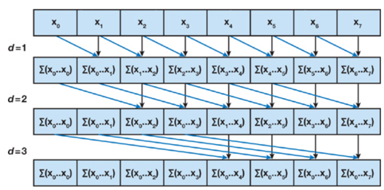
The naive implementation of the algorithm simply sees us adding values of a certain stride away from the target to the target in parallel, involving several iterations until the full scan is complete. 
This involved launching several kernels in sequence, updating our stride each iteration:

```
for (int d = 1; d <= ilog2ceil(n); d++)
{
    scan<<<numBlocks, BLOCKSIZE>>>(n, d, d_odata, d_idata);
}
```
While this could have been optimized with shared memory utilization, the optimization of this algorithm was not the intent of this project. Rather the optimization of the work-efficient scan was the main focal point of the project which I will discuss now.

### Work-Efficient Scan
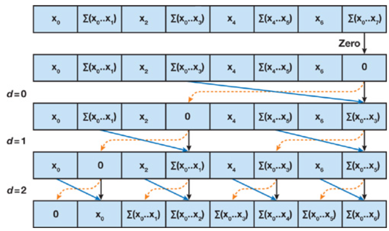
The work-efficient scan algorithm is discussed in detail in [GPU Gems 3 Chapter 39.2](https://developer.nvidia.com/gpugems/gpugems3/part-vi-gpu-computing/chapter-39-parallel-prefix-sum-scan-cuda), but its implementation caused several issues which needed to be addressed. 
Namely:
* Arbitrary Array Length
* Array Length Exceeding Blocksize
* Global Memory Access Latency

In order to address these issues, two techniques were utilized: per-block scanning and shared memory. Per-block scanning addresses the inability for thread communication across blocks. Rather than scanning the entire array at once (which breaks apart once the array size is larger than the block size) 
we instead scan within each block, store final sum of each block's scan in another array, scan that array, and add each element in the scanned sum array to all the values in the corresponding block in the original array:
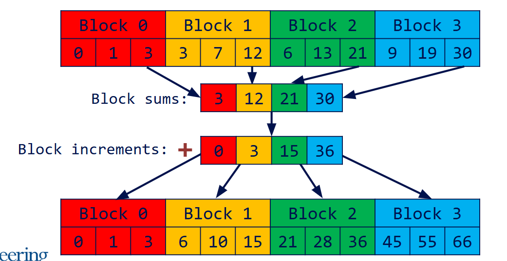

Of course, when this intermediary block sum array reaches a length larger than the blocksize, we then again must perform this technique to scan that array, thus leading to a recursive implementation of this technique as seen here:
```
void scanRecursive(int n, int* data)
{
    int numBlocks = (n + BLOCKSIZE - 1) / BLOCKSIZE;

    int* d_blockSums;
    cudaMalloc((void**)&d_blockSums, numBlocks * sizeof(int));

    scan << <numBlocks, BLOCKSIZE, BLOCKSIZE * sizeof(int) >> > (n, ilog2ceil(BLOCKSIZE), data, d_blockSums);

    if (numBlocks >= BLOCKSIZE)
    {
        scanRecursive(numBlocks, d_blockSums);
    }
    else
    {
        scan << <1, BLOCKSIZE, BLOCKSIZE * sizeof(int) >> > (numBlocks, ilog2ceil(BLOCKSIZE), d_blockSums); // scan only once more on final iteration
    }
    add << <numBlocks, BLOCKSIZE >> > (n, data, d_blockSums);

    cudaFree(d_blockSums);
}
```
This combined with padding of arrays to the nearest power of 2 for non-power of 2 size arrays allowed for scanning of arrays of arbitrary length regardless of block size.  

### Shared Memory
As mentioned above, shared memory was implemented as an attempt to reduce the overhead caused by global memory accesses. This is also covered in [GPU Gems 3 Chapter 39.2](https://developer.nvidia.com/gpugems/gpugems3/part-vi-gpu-computing/chapter-39-parallel-prefix-sum-scan-cuda), 
but in order to avoid potential bank conflicts, address padding was utilized, a diagram of which can be seen here:
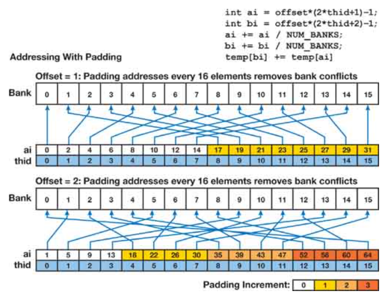

This essentially ensures that for each multiple of the number of banks n on our machine, we pad the address such that it differs from previous groupings of n address. Whether or not this improved runtime will be discussed in the analysis.

## Performance Comparison
The following charts show the performance comparison between the CPU, naive parallel scan, work-efficient parallel scan, work-efficient parallel scan with shared memory, and thrust implementations for different array sizes, 
with the first and second charts showing array sizes of powers of two and non-powers of two respectfully.  
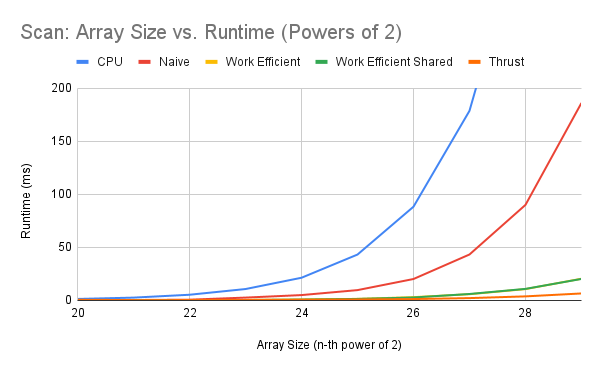
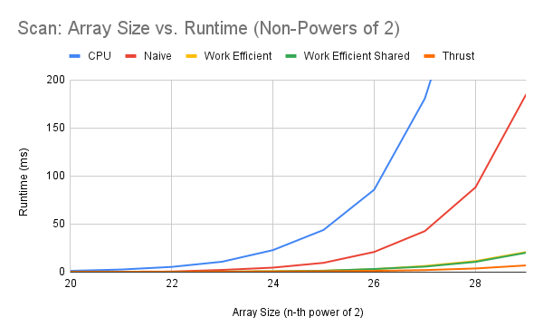

The following charts show the performance comparison between the stream compaction implementations of CPU without scan, CPU with scan, work-efficient compaction, and work-efficient compaction using shared memory for different array sizes, 
with the first and second charts showing array sizes of powers of two and non-powers of two respectfully.  
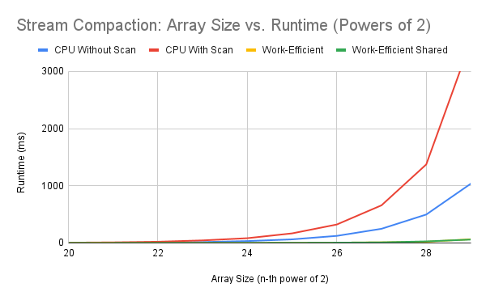
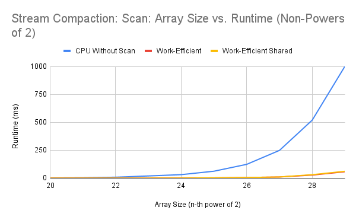

## Analysis
We can see that our implementations are ranked as follows: CPU -> Naive -> Work-Efficient -> Thrust, as is expected. Notably, it appears that the shared memory implementation did not affect performance to any noticable degree, potentially indicating that the performance bottleneck does 
not lie in memory access, or could be indication of another problem:

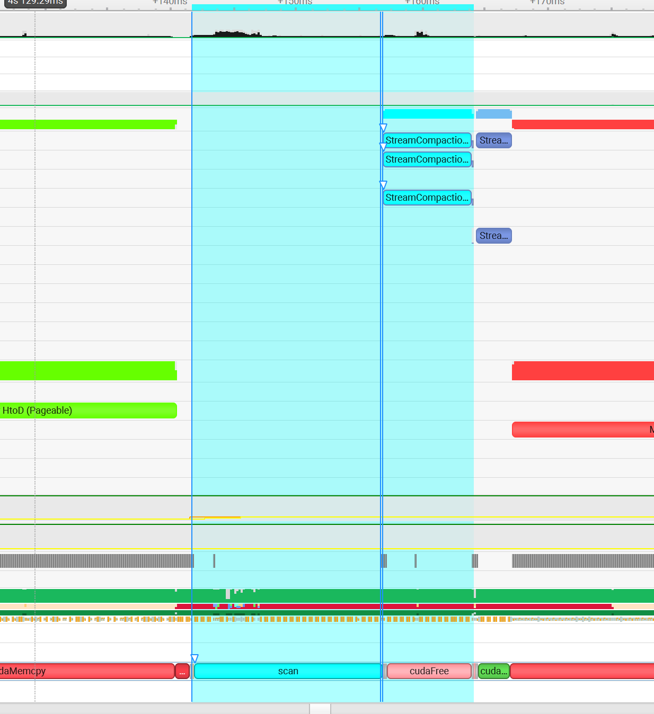
Here we see the analysis of the kernel in NSight Systems. As we can see, a majority of the runtime of the kernel is actually dedicated to the kernel launch as seen on the bottom. It is possible that this could indicate the overhead of 
allocating shared memory, however, this same launch overhead was seen with the non-shared memory implementation. Regardless, the actual runtime of the shared vs. non-shared memory kernel is largely the same, so the shared memory implementation can still be optimized and can be the subject of future work.

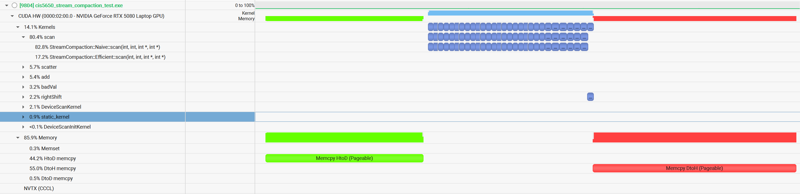
Here we see the analysis of the naive kernel. As shown, it really consists of several kernel launches. Still, it seems that there is little in terms of API overhead, and so the performance issues likely stem from the poor optimization of the algorithm.

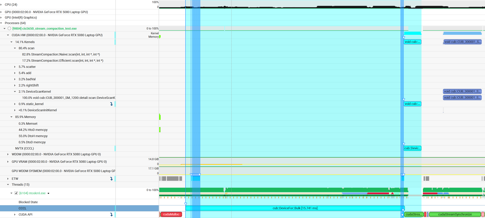
Here we see the analysis of the thrust kernel. As shown, most of the runtime consists of this CUDA::DeviceFor::Bulk kernel, which is part of the core compute library. This function applies a function object to each index in a target. It likely uses this to help perform scan by applying some operation to each 
element of an array before finally performing scan on it.

### Testing Sample
The following is a example of the output of the test cases used to validate the implementations, in this case testing an array of size 2^28.
```
****************
** SCAN TESTS **
****************
    [  44   2  18  14  23  28  17   2  39   4  47  35  44 ...  47   0 ]
==== cpu scan, power-of-two ====
   elapsed time: 343.195ms    (std::chrono Measured)
    [   0  44  46  64  78 101 129 146 148 187 191 238 273 ... -2015370831 -2015370784 ]
==== cpu scan, non-power-of-two ====
   elapsed time: 338.659ms    (std::chrono Measured)
    [   0  44  46  64  78 101 129 146 148 187 191 238 273 ... -2015370921 -2015370883 ]
    passed
==== naive scan, power-of-two ====
   elapsed time: 87.9623ms    (CUDA Measured)
    [   0  44  46  64  78 101 129 146 148 187 191 238 273 ... -2015370831 -2015370784 ]
    passed
==== naive scan, non-power-of-two ====
   elapsed time: 88.395ms    (CUDA Measured)
    [   0  44  46  64  78 101 129 146 148 187 191 238 273 ...   0   0 ]
    passed
==== work-efficient scan shared memory, power-of-two ====
   elapsed time: 10.1034ms    (CUDA Measured)
    [   0  44  46  64  78 101 129 146 148 187 191 238 273 ... -2015370831 -2015370784 ]
    passed
==== work-efficient scan shared memory, non-power-of-two ====
   elapsed time: 10.888ms    (CUDA Measured)
    [   0  44  46  64  78 101 129 146 148 187 191 238 273 ... -2015370921 -2015370883 ]
    passed
==== thrust scan, power-of-two ====
   elapsed time: 3.83693ms    (CUDA Measured)
    [   0  44  46  64  78 101 129 146 148 187 191 238 273 ... -2015370831 -2015370784 ]
    passed
==== thrust scan, non-power-of-two ====
   elapsed time: 3.87962ms    (CUDA Measured)
    [   0  44  46  64  78 101 129 146 148 187 191 238 273 ... -2015370921 -2015370883 ]
    passed

*****************************
** STREAM COMPACTION TESTS **
*****************************
    [   2   0   2   0   0   2   1   0   1   0   2   2   2 ...   1   0 ]
==== cpu compact without scan, power-of-two ====
   elapsed time: 497.776ms    (std::chrono Measured)
    [   2   2   2   1   1   2   2   2   3   3   1   2   1 ...   3   1 ]
    passed
==== cpu compact without scan, non-power-of-two ====
   elapsed time: 495.336ms    (std::chrono Measured)
    [   2   2   2   1   1   2   2   2   3   3   1   2   1 ...   2   3 ]
    passed
==== cpu compact with scan ====
   elapsed time: 1364.17ms    (std::chrono Measured)
    [   2   2   2   1   1   2   2   2   3   3   1   2   1 ...   3   1 ]
    passed
==== work-efficient compact shared memory, power-of-two ====
   elapsed time: 28.1246ms    (CUDA Measured)
    [   2   2   2   1   1   2   2   2   3   3   1   2   1 ...   3   1 ]
    passed
==== work-efficient compact shared memory, non-power-of-two ====
   elapsed time: 27.7669ms    (CUDA Measured)
    [   2   2   2   1   1   2   2   2   3   3   1   2   1 ...   2   3 ]
    passed
```